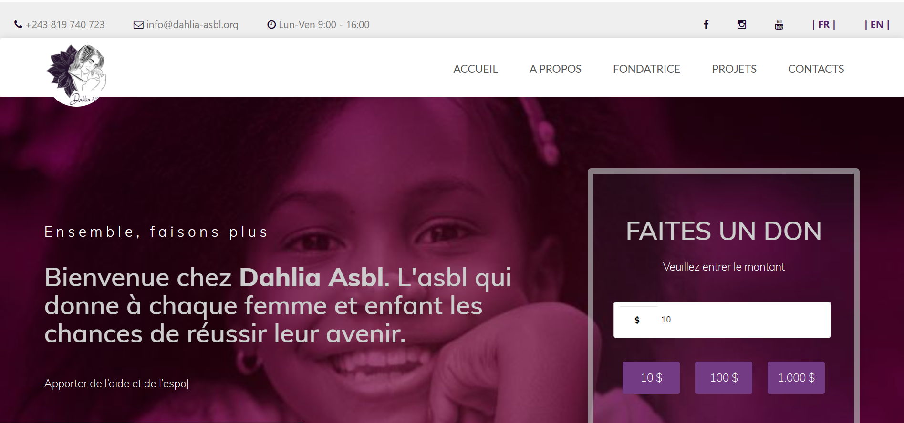
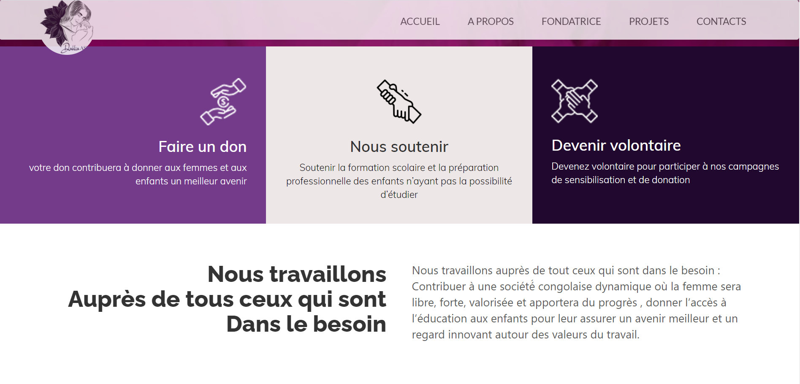
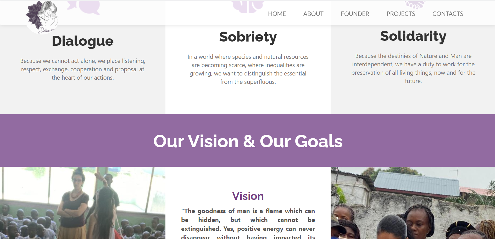
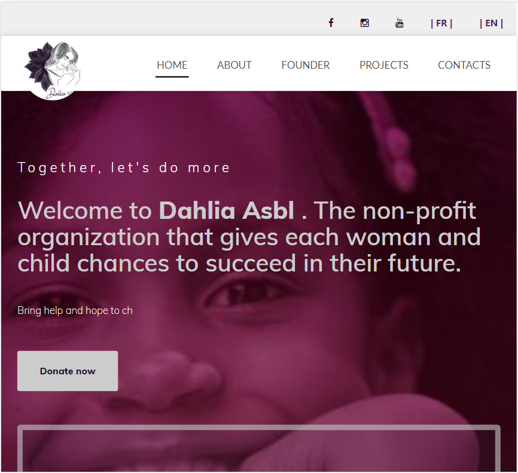
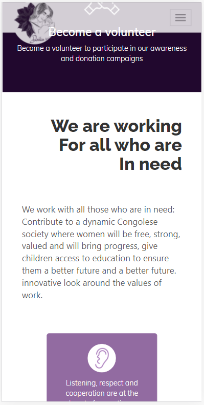

# Dahlia ASBL

> Dahlia ASBL is a non-profit organisation which helps children and women to live their better life 
> This website is Responsive and allows users to make donations via PayPal and Stripe

<h4>Screeshots</h4>

> Desktop version 

>> This website is bilingual

> Tablet version 

> Mobile version 

## Built With

- ReactJs
- Bootstrap 
- @materialUi/core
- NodeJs

## Live link

[Live Demo](https://dahlia-asbl.org/)

## Getting Started

1. First clone the project 
  `$ git clone https://pacyl2k19.github.io/dahlia-asbl/`
2. The go to the specific directory 
  `$ cd dahli-asbl`
3. Install all the node packages 
  `$ npm install`
4. Execute the project
  `$ npm run start`
5. [Optional] Go to the `package.json` file and see all the commands available on the `scripts` field.

To get a local copy up and running follow these simple example steps.

### Prerequisites

- Install `git`
- Install `nodeJs`
- Have at least one code editor 

## 👤 Author

- GitHub: [@pacyL2K19](https://github.com/pacyL2K19)
- Twitter: [@PacifiqueLinja1](https://twitter.com/PacifiqueLinja1)
- LinkedIn: [LinkedIn](https://www.linkedin.com/in/pacifique-linjanja-2a565517b/)

## 🤝 Contributing

Contributions, issues, and feature requests are welcome!
Feel free to contribute 
Feel free to check the [issues page](https://github.com/pacyL2K19/dahlia-asbl/issues/).

## Show your support

Give a ⭐️ if you like this project!

